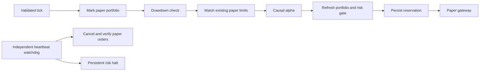

# Phase 1: isolated intraday paper kernel

Implemented 2026-09-23. This is an executable foundation and behavior-tested reference, not a claim of institutional production readiness. It is deliberately separate from the running desk's existing paper workday and IBKR manual execution path. No real-money commands or enablement flags were changed.

## Files and flow

- `quant_models.py`: immutable Pydantic 2 contracts for `Tick`, `Signal`, `Order`, `Fill`, `Portfolio`, `RiskDecision`, and `RiskConfig`. Reject extra fields, non-finite prices, crossed markets, naive timestamps, noncausal signals and unreconciled paper equity.
- `quant_risk.py`: SQLite WAL state, audit trail, cash/holdings, unique signal/order/fill IDs, atomic partial fills, risk reservations and durable kill latch.
- `quant_engine.py`: `ExecutionGateway` / `Alpha` protocols, `PaperGateway`, a causal reference momentum strategy and `PaperEngine` using an independent asyncio watchdog.
- `tools/replay_quant.py`: explicit recorded-tick JSONL replay into a new database. It never connects to a broker and refuses to overwrite a database.



SQLite is sufficient for this single process and single event-loop owner. Adding Redis would not improve correctness here and would create another service to launch. SQLite calls are intentionally short and synchronous; timeout is two seconds. Measure commit latency before high-rate deployment. The watchdog cannot compensate for a blocked CPU or event loop; providers and alpha implementations must yield and obey cancellation.

## Exact risk policy

High-water equity persists. Explicit net cash-flow changes adjust the prior peak before comparing current equity. Drawdown is `(peak - equity) / peak`. Dynamic loss threshold is `max(min_drawdown, min(max_drawdown, max_drawdown * target_volatility / portfolio_volatility))`. Defaults are a 4% maximum, 1% minimum and 1% target return volatility per observation interval. These are configurable engineering assumptions, not optimized trading parameters.

Buy quantity is the minimum of the signal's dollar budget (including assumed fees), $100 default order cap, available cash after all pending reservations, 5% position / 25% gross portfolio limits, displayed ask size, and `equity * risk_fraction * drawdown_throttle / (price * max(volatility, volatility_floor))`. Default risk fraction is 0.1%; drawdown throttle falls linearly to zero at the kill threshold. Round down to a 0.000001-share increment. Sells reduce owned holdings only. This Phase 1 kernel has limit orders only; the existing desk's options and market-order workflows are separate.

The volatility estimate uses observed returns; the reference alpha warms up with 20 returns and resets after gaps over five seconds. The portfolio uses a conservative weighted average of held-symbol volatilities, not a covariance model. Observation cadence must be comparable and validated by the data adapter; irregular high-frequency ticks are not an interchangeable volatility unit. No mean-reversion, momentum or profit advantage is assumed.

Ticks must be causal, unhalted, within regular US sessions, no more than five seconds old and increasing per symbol. Source labels containing mock/synthetic/fixture are rejected. Labels alone do not prove authenticity: the external feed must supply trustworthy provenance, sizes and timestamps. Recorded replay is separate from the application's learned research evidence and never trains its ranking weights.

The monotonic watchdog runs even without ticks or while alpha awaits. After ten seconds of a required feed stall it latches a halt and requests cancellation of every active paper order. Order deadlines independently cancel old residual quantities. Timeouts or missing acknowledgements preserve reservations, record failure, and block new orders. A feed ending or interrupted process requires review; active reservations at startup cause a durable halt. No automatic halt reset is exposed. Review the persisted orders, fills, balances and cause before beginning a new isolated run. An operator reconciliation/resume workflow is intentionally outside Phase 1.

## Running an offline replay

From the repository directory, after installing `requirements.txt` in its virtual environment:

```powershell
.venv\Scripts\python.exe tools\replay_quant.py --ticks C:\path\recorded-ticks.jsonl --database C:\path\new-paper-run.sqlite3 --cash 1000
```

Each line must validate as `Tick`. Example shape (illustrative data only, not evidence):

```json
{"symbol":"SPY","market_at":"2026-09-23T15:00:00+00:00","received_at":"2026-09-23T15:00:00.050+00:00","bid":"100.00","ask":"100.01","bid_size":"20","ask_size":"15","source":"your_verified_capture","data_kind":"recorded","halted":false}
```

The replay preserves recorded receipt/market times; gaps advance the watchdog clock. It never creates filler ticks or rewrites timestamps to pretend data is fresh. A fresh run starts with cash and no positions; ending a feed cancels residual orders but does not invent liquidation fills. The output therefore reports cash and remaining positions, not a fabricated final realized return.

## Qualification boundary

The external broker stub raises `ExecutionUnavailable` on every method. `PaperEngine` rejects non-paper gateways. There is no flag that turns this new kernel into live execution. The existing app's manual enablement document remains separate. Future broker integration requires actual contract/tick-size/fractional eligibility, account and buying-power verification, partial/late fill reconciliation, broker-side order identity, crash recovery, exchange calendars, backpressure, feed entitlements, real fees, halts and independent market-hours validation. It must not be connected by renaming an environment field.

Tests exercise sizing/reservations, causal filtering, duplicate fills/signals, partial fills, persistent state, drawdown-before-fill, stalled feeds, slow alpha, expiry, ambiguous submit/cancel and paper-only enforcement. Network is blocked except Windows asyncio's internal wake-up socketpair. These tests do not demonstrate broker execution or a profitable strategy.

Technical references: [Pydantic models](https://docs.pydantic.dev/latest/concepts/models/), [Python asyncio task groups and timeouts](https://docs.python.org/3/library/asyncio-task.html).
